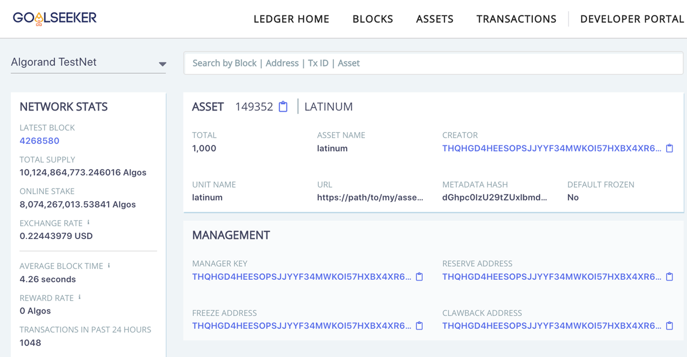

Tutorial – Algorand Standard Assets (ASA)
=========================================

The Algorand platform is a general-purpose economic exchange system which
represents an extremely broad market. A given platform’s attractiveness and
effectiveness as a means of economic exchange can be defined by the combination
of what you can own and how you can transact.

Algorand Standard Assets represents Algorand’s ability to digitize any asset and
have both it and its ownership represented on chain. These assets could be
fungible (for example: currencies, stable coins, loyalty points, system credits,
in-game points, etc) or non-fungible (for example: real estate, collectables,
supply chain, in-game items, tickets, etc). In addition, our functionality
allows restrictions to be placed on the assets where needed (for example:
securities, certifications, compliance, etc).

Algorand has implemented named assets as a truly layer 1 asset. This allows any
asset created on Algorand to enjoy:

**Increased security** - New assets will enjoy the same security and safety as
Algos, the native currency on Algorand

**Inherent compatibility** - Apps that support any Algorand asset will support
all Algorand assets

**High ease of use** - Create your asset with a single transaction to the
network


Step 1A - Create 3 Accounts and add Algos to the Accounts
--------------------------------------------------

Assets are created at the account level. Each account can have up to 1000 assets for creator accounts as well as for consumer accounts. So, before starting the ASA tutorial, 3 new accounts will be created for this step for ASA transactions. Once created, copy off the account mnumonic and account address values.  

**Task 1A-1** Create an empty code file for desired language of choice (CreateNewAccounts.js, CreateNewAccounts.py, CreateNewAccounts.java, or CreateNewAccounts.go). Then simply copy the and insert the snippet. Update the node token and url, and run. Then copy off the account addresses and mnumonics. In Step 1B, we will paste those into the TutorialASA code and recover the account using the mnemonics created in this step. Mnumonics are for demonstration purposes. **NEVER** reveal secret mnemonics in practice.

In order to run ASA transactions, or any transactions for that matter, the accounts need to have TestNet Algo funds. Load all 3 accounts from the Algorand TestNet Dispenser which is located here: <https://bank.testnet.algorand.network/>

**Note:**
    See the appropriate GitHub repository for installing the supported SDKs:

[JavaScript](https://github.com/algorand/js-algorand-sdk)

[Python](https://github.com/algorand/py-algorand-sdk)

[Java](https://github.com/algorand/java-algorand-sdk)

[Go Lang](https://github.com/algorand/go-algorand-sdk)

Community SDKs 

[.NET / C#](https://github.com/RileyGe/dotnet-algorand-sdk) All Algorand 2.0 functions, including ASA, are available and demonstrated in the sample code github repository (just not in this tutorial yet)

[Rust (no Algorand 2.0 functions at this time)](http://mraof.com/temp/algosdk-doc/algosdk/)

**Note:**
    If you do not have a node setup, see these [instructions](https://developer.algorand.org/docs/introduction-installing-node). Also, another alternative is to use [PureStake](https://www.purestake.com/algorand-api).


```go tab="Go"
//Go
package main

import (
	json "encoding/json"
	"fmt"

	"github.com/algorand/go-algorand-sdk/crypto"
	"github.com/algorand/go-algorand-sdk/mnemonic"
)

func main() {
	account1 := crypto.GenerateAccount()
	account2 := crypto.GenerateAccount()
	account3 := crypto.GenerateAccount()
	address1 := account1.Address.String()
	address2 := account2.Address.String()
	address3 := account3.Address.String()

	mnemonic1, err := mnemonic.FromPrivateKey(account1.PrivateKey)
	if err != nil {
		return
	}
	mnemonic2, err := mnemonic.FromPrivateKey(account2.PrivateKey)
	if err != nil {
		return
	}
	mnemonic3, err := mnemonic.FromPrivateKey(account3.PrivateKey)
	if err != nil {
		return
	}
	fmt.Printf("Account 1 = %s\n", address1)
	fmt.Printf("Account 2 = %s\n", address2)
	fmt.Printf("Account 3 = %s\n", address3)
	fmt.Printf("")
	fmt.Printf("Copy off accounts above and add TestNet Algo funds using the TestNet Dispenser at https://bank.testnet.algorand.network/\n")	
	fmt.Printf("Copy off the following mnemonic code for use in Step 1B\n")
	fmt.Printf("\n")	
	fmt.Printf("mnemonic1 := \"%s\"\n", mnemonic1)
	fmt.Printf("mnemonic2 := \"%s\"\n", mnemonic2)
	fmt.Printf("mnemonic3 := \"%s\"\n", mnemonic3)
}

// Terminal output should look similar to this...

// Account 1 = BQBRKJ7KSQO6WWX3QRSITPCZOEDOT6DX6MJVQQFQI72PDPTKWU5WKOOJ2I
// Account 2 = LBMZ2DNGB5N7AJNZQZPMTPDJRW3S6OB6YR4EHE5RYODRS67TILA5H23K4A
// Account 3 = 6AVEBUP35AHIKDA6UGSFM6LP433AUHVRZNW4KHAXOYCOYDYOLFJWZ7J3I4
// Copy off accounts above and add TestNet Algo funds using the TestNet Dispenser at https://bank.testnet.algorand.network/
// Copy off the following mnemonic code for use in Step 1B

// mnemonic1 := "fatigue laundry small early radar code supreme diary skin record slice distance bike skirt guard surround miss turtle horror frame train taxi column ability forest"
// mnemonic2 := "ill live coconut risk east flower snack develop boring enroll nest rice mistake pioneer rival account coffee depend bachelor orient rebel inform throw absent option"
// mnemonic3 := "broom bid found recall stick gas sample copy network mistake mind relief rely file disorder east asthma program filter hedgehog legal walnut wait about slogan"
```


Step 1B Setup Accounts, Utility Functions and Tools
--------------------------------------------------

This tutorial will use three TestNet accounts that have been pre-created in Step 1A. Be sure to dispense Algos to these accounts before continuing, using the TestNet Dispenser.

The TestNet dispenser is located here:
<https://bank.testnet.algorand.network/>

The accounts used in this tutorial are: (yours will be different)

Account 1
`THQHGD4HEESOPSJJYYF34MWKOI57HXBX4XR63EPBKCWPOJG5KUPDJ7QJCM`

Account 2
`AJNNFQN7DSR7QEY766V7JDG35OPM53ZSNF7CU264AWOOUGSZBMLMSKCRIU`

Account 3
`3ZQ3SHCYIKSGK7MTZ7PE7S6EDOFWLKDQ6RYYVMT7OHNQ4UJ774LE52AQCU`

**Info:**
    You may want to verify account information periodically as well as transactions
    with asset information during the course of this tutorial. You can use either
    the [Algo TestNet Explorer](https://testnet.algoexplorer.io/) or use the Purestake's [Goalseeker](https://goalseeker.purestake.io/algorand/testnet), which also
    facilitates search by asset ID.

 to search on Address, Transaction, Block or AssetID](../imgs/TutorialASA-01.png)
**Figure Step 1B-1** Purestake’s Goalseeker used to search Address,
Transaction, Block or AssetID.
<!-- <center></center>
<center>**Figure Step 1A-1** Use Purestake’s Goalseeker to search Address,
Transaction, Block or AssetID.</center> -->

The tutorial code below is separated into snippets categorized by ASA core functions and is laid out in order. The solution should be coded as a single script for each respective language. 

**Task 1B-1** Create an empty code file for desired language of choice (TutorialASA.js, TutorialASA.py, TutorialASA.java, or TutorialASA.go). Then simply copy the code below and paste into the empty file. Then append the each snippet after the last line of code in the prior step as you read through this tutorial.


```go tab="Go"
//Go
package main

import (
// b64 "encoding/base64"
json "encoding/json"
"fmt"
"github.com/algorand/go-algorand-sdk/client/algod"
// "github.com/algorand/go-algorand-sdk/crypto"
"github.com/algorand/go-algorand-sdk/mnemonic"
// "github.com/algorand/go-algorand-sdk/transaction"
)

// UPDATE THESE VALUES
const algodAddress = "ADDRESS"
const algodToken = "TOKEN"

var txHeaders = append([]\*algod.Header{}, &algod.Header{"Content-Type","application/json"})
// Accounts to be used through examples
func loadAccounts() (map[int][]byte, map[int]string) {
// Shown for demonstration purposes. NEVER reveal secret mnemonics in practice.
// Change these values to uese the accounts created in Step 1A.
    var pks = map[int]string{
    1: "Account Address 1 from Step 1A",
    2: "Account Address 2 from Step 1A",
    3: "Account Address 3 from Step 1A",
}

// Paste in mnemonic phrases for all three accounts from Step 1A
mnemonic1 := "PASTE your phrase for account 1 from Step 1A"
mnemonic2 := "PASTE your phrase for account 2 from Step 1A"
mnemonic3 := "PASTE your phrase for account 2 from Step 1A"

mnemonics := []string{mnemonic1, mnemonic2, mnemonic3}
var sks = make(map[int][]byte)
for i, m := range mnemonics {
var err error
sks[i+1], err = mnemonic.ToPrivateKey(m)
if err != nil {
fmt.Printf("Issue with account %d private key conversion.", i+1)
} else {
fmt.Printf("Loaded Key %d: %s\\n", i+1, pks[i+1])
}
}
return sks, pks
}
// Function that waits for a given txId to be confirmed by the network
func waitForConfirmation(algodClient algod.Client, txId string) {
for {
b3, err := algodClient.PendingTransactionInformation(txId, txHeaders...)
if err != nil {
fmt.Printf("waiting for confirmation... (pool error, if any): %s\\n", err)
continue
}
if b3.ConfirmedRound \> 0 {
fmt.Printf("Transaction "+b3.TxID+" confirmed in round %d\\n",
b3.ConfirmedRound)
break
}
}
}

// Pretty prints Go structs
func PrettyPrint(data interface{}) {
var p []byte
// var err := error
p, err := json.MarshalIndent(data, "", "\\t")
if err != nil {
fmt.Println(err)
return
}
fmt.Printf("%s \\n", p
}

// Main function to demonstrate ASA examples

func main() {
// Get pre-defined set of keys for example
sks, pks := loadAccounts(
// Initialize an algodClien
algodClient, err := algod.MakeClient(algodAddress, algodToken
if err != nil 
return
// Get network-related transaction parameters and assign
txParams, err := algodClient.SuggestedParams()
if err != nil {
fmt.Printf("error getting suggested tx params: %s\\n", err)
return
}

// Print asset info for newly created asset.
PrettyPrint(txParams)
PrettyPrint(sks)
PrettyPrint(pks)
}

//Your console/terminal outpur should look similar to this...

// Loaded Key 1: THQHGD4HEESOPSJJYYF34MWKOI57HXBX4XR63EPBKCWPOJG5KUPDJ7QJCM
// Loaded Key 2: AJNNFQN7DSR7QEY766V7JDG35OPM53ZSNF7CU264AWOOUGSZBMLMSKCRIU
// Loaded Key 3: 3ZQ3SHCYIKSGK7MTZ7PE7S6EDOFWLKDQ6RYYVMT7OHNQ4UJ774LE52AQCU

// {
// "fee": 1,
// "genesisID": "testnet-v1.0",
// "genesishashb64": "SGO1GKSzyE7IEPItTxCByw9x8FmnrCDexi9/cOUJOiI="
// "lastRound": 4268229,
// "consensusVersion": "https://github.com/algorandfoundation/specs/tree/4a9db6a25595c6fd097cf9cc137cc83027787eaa"
// }

// {
// "1":"QkWlt0yawnHOIvkgkQ3tbEo6KudsGmDRYtlQ1OeieN2Z4HMPhyEk58kpxgu+MspyO/PcN+Xj7ZHhUKz3JN1VHg==",
// "2":"Lg1Ge0vafd1jv8FbrXcwDEJnbnA9kIpH68XQUoY88SUCWtLBvxyj+BMf96v0jNvrns7vMml+KmvcBZzqGlkLFg==",
// "3":"iuM5VLAiDUsfFLsr0QG8d7KB1/jXdlIBeA9IKAXAoXreYbkcWEKkZX2Tz95Py8Qbi2WocPRxirJ/cdsOUT//Fg=="
// }
// {
// "1": "THQHGD4HEESOPSJJYYF34MWKOI57HXBX4XR63EPBKCWPOJG5KUPDJ7QJCM",
// "2": "AJNNFQN7DSR7QEY766V7JDG35OPM53ZSNF7CU264AWOOUGSZBMLMSKCRIU",
// "3": "3ZQ3SHCYIKSGK7MTZ7PE7S6EDOFWLKDQ6RYYVMT7OHNQ4UJ774LE52AQCU"
// }
```

Step 2 Create a New Asset
---------------------------

The ability to create asserts directly on the blockcahin is an exciting capability of the Algorand Blockchain. Possible uses include currency, game leader boards, points in a loyalty system, shares of an asset, and securities such as stocks, bonds, and derivaties.  


**Info:**
    The decimals value determines the placement of the decimal. For example, when `decimals = 2`, and the `amount = 1000`, the acatual amount is 10.00. So, when a  transfer of amount of 10 is made, the actual transfer is .10


**Note:**
	With the **Go** code solution, paste this snippet before the final curly brace `}` and uncommnet the import libraries at the top as needed. 


**Task 2-1** Account 1 creates an asset called latinum and sets Account 2 as the manager, reserve, freeze, and clawback address.


```go tab="Go"
    // Go
    // Insert code after Step 1 code

	// Create an Asset
	// uncomment these imports at the top
	// 	-	b64 "encoding/base64"
	//  - 	"github.com/algorand/go-algorand-sdk/transaction"
	// 	-	"github.com/algorand/go-algorand-sdk/crypto"
	fee := txParams.Fee
	firstRound := txParams.LastRound
	lastRound := txParams.LastRound + 1000
	genHash := b64.StdEncoding.EncodeToString(txParams.GenesisHash)
	genID := txParams.GenesisID

	// Create an asset
	// Set parameters for asset creation transaction
	creator := pks[1]
	assetName := "latinum"
	unitName := "latinum"
	assetURL := "https://path/to/my/asset/details"
	assetMetadataHash := "thisIsSomeLength32HashCommitment"
	defaultFrozen := false
	decimals := uint32(0)
	totalIssuance := uint64(1000)
	manager := pks[2]
	reserve := pks[2]
	freeze := pks[2]
	clawback := pks[2]
	note := []byte(nil)
	txn, err := transaction.MakeAssetCreateTxn(creator, fee, firstRound, lastRound, note,
		genID, genHash, totalIssuance, decimals, defaultFrozen, manager, reserve, freeze, clawback,
		unitName, assetName, assetURL, assetMetadataHash)
	if err != nil {
		fmt.Printf("Failed to make asset: %s\n", err)
		return
	}
	fmt.Printf("Asset created AssetName: %s\n", txn.AssetConfigTxnFields.AssetParams.AssetName)

	txid, stx, err := crypto.SignTransaction(sks[1], txn)
	if err != nil {
		fmt.Printf("Failed to sign transaction: %s\n", err)
		return
	}
	fmt.Printf("Transaction ID: %s\n", txid)
	// Broadcast the transaction to the network
	sendResponse, err := algodClient.SendRawTransaction(stx)
	if err != nil {
		fmt.Printf("failed to send transaction: %s\n", err)
		return
	}

	// Wait for transaction to be confirmed
	waitForConfirmation(algodClient, sendResponse.TxID)

	// Retrieve asset ID by grabbing the max asset ID
	// from the creator account's holdings.
	act, err := algodClient.AccountInformation(pks[1], txHeaders...)
	if err != nil {
		fmt.Printf("failed to get account information: %s\n", err)
		return
	}
	assetID := uint64(0)
	for i, _ := range act.AssetParams {
		if i > assetID {
			assetID = i
		}
	}
	fmt.Printf("Asset ID from AssetParams: %d\n", assetID)

	// Retrieve asset info.
	assetInfo, err := algodClient.AssetInformation(assetID, txHeaders...)

	// Print asset info for newly created asset.
	PrettyPrint(assetInfo)
	// terminal output should look similar to this

	// terminal outout should loiok similar to this
	// Asset created AssetName: latinum
	// Transaction ID: 4P4ACUIZTWYGFPSRZ6BPD4P64XZCYN2ZOHO33N4V7TYE2KWWDA4Q
	// Transaction 4P4ACUIZTWYGFPSRZ6BPD4P64XZCYN2ZOHO33N4V7TYE2KWWDA4Q confirmed in round 4308303
	// Asset ID from AssetParams: 151771
	// {
	// 	"creator": "THQHGD4HEESOPSJJYYF34MWKOI57HXBX4XR63EPBKCWPOJG5KUPDJ7QJCM",
	// 	"total": 1000,
	// 	"decimals": 0,
	// 	"defaultfrozen": false,
	// 	"unitname": "latinum",
	// 	"assetname": "latinum",
	// 	"url": "https://path/to/my/asset/details",
	// 	"metadatahash": "dGhpc0lzU29tZUxlbmd0aDMySGFzaENvbW1pdG1lbnQ=",
	// 	"managerkey": "AJNNFQN7DSR7QEY766V7JDG35OPM53ZSNF7CU264AWOOUGSZBMLMSKCRIU",
	// 	"reserveaddr": "AJNNFQN7DSR7QEY766V7JDG35OPM53ZSNF7CU264AWOOUGSZBMLMSKCRIU",
	// 	"freezeaddr": "AJNNFQN7DSR7QEY766V7JDG35OPM53ZSNF7CU264AWOOUGSZBMLMSKCRIU",
	// 	"clawbackaddr": "AJNNFQN7DSR7QEY766V7JDG35OPM53ZSNF7CU264AWOOUGSZBMLMSKCRIU"
	// }
```

Step 3 Configure Asset Manager
------------------------------
Assets can be managed as to which accounts have roles for overall manager, reserve, freeze, and clawback functions. By default all of these roles are set to the creator account. 

Asset reconfiguration allows the address specified as manager to change any of the special addresses for the asset, such as the reserve address. To keep an address the same, it must be re-specified in each new configuration transaction. Supplying an empty address is the same as turning the associated feature off for this asset. Once a special address is set to the empty address, it can never change again. For example, if an asset configuration transaction specifying clawback="" were issued, the associated asset could never be revoked from asset holders, and clawback="" would be true for all time. The  strictEmptyAddressChecking argument can help with this behavior: when set to its default true, makeAssetConfigTxn will throw an error if any undefined management addresses are passed.

**Task 3-1** Here, the current manager (Account 2) issues an asset configuration transaction that assigns Account 1 as the new manager.


```go tab="Go"
    // Go
    // Insert after Step 2's code

	// Change Asset Manager from Account 2 to Account 1
	manager = pks[1]
	oldmanager := pks[2]
	strictEmptyAddressChecking := true
	txn, err = transaction.MakeAssetConfigTxn(oldmanager, fee, firstRound, lastRound, note, genID, genHash, assetID, manager, reserve, freeze, clawback, strictEmptyAddressChecking)
	if err != nil {
		fmt.Printf("Failed to send txn: %s\n", err)
		return
	}

	txid, stx, err = crypto.SignTransaction(sks[2], txn)
	if err != nil {
		fmt.Printf("Failed to sign transaction: %s\n", err)
		return
	}
	fmt.Printf("Transaction ID: %s\n", txid)
	// Broadcast the transaction to the network
	sendResponse, err = algodClient.SendRawTransaction(stx)
	if err != nil {
		fmt.Printf("failed to send transaction: %s\n", err)
		return
	}
	fmt.Printf("Transaction ID raw: %s\n", sendResponse.TxID)

	// Wait for transaction to be confirmed
	waitForConfirmation(algodClient, sendResponse.TxID)
	// Retrieve asset info.
	assetInfo, err = algodClient.AssetInformation(assetID, txHeaders...)
	// Print asset info showing updated manager address.
	PrettyPrint(assetInfo)

	// Your terminal output should appear similar to this...

	// 	Transaction HC6XR26GVMUZW26HBFHWU45Z4TI3XK4E7WR6IJ3BABPXVTLXI3UA confirmed in round 4309244

	// {
	// 	"creator": "THQHGD4HEESOPSJJYYF34MWKOI57HXBX4XR63EPBKCWPOJG5KUPDJ7QJCM",
	// 	"total": 1000,
	// 	"decimals": 0,
	// 	"defaultfrozen": false,
	// 	"unitname": "latinum",
	// 	"assetname": "latinum",
	// 	"url": "https://path/to/my/asset/details",
	// 	"metadatahash": "dGhpc0lzU29tZUxlbmd0aDMySGFzaENvbW1pdG1lbnQ=",
	// 	"managerkey": "THQHGD4HEESOPSJJYYF34MWKOI57HXBX4XR63EPBKCWPOJG5KUPDJ7QJCM",
	// 	"reserveaddr": "AJNNFQN7DSR7QEY766V7JDG35OPM53ZSNF7CU264AWOOUGSZBMLMSKCRIU",
	// 	"freezeaddr": "AJNNFQN7DSR7QEY766V7JDG35OPM53ZSNF7CU264AWOOUGSZBMLMSKCRIU",
	// 	"clawbackaddr": "AJNNFQN7DSR7QEY766V7JDG35OPM53ZSNF7CU264AWOOUGSZBMLMSKCRIU"
	// }
```

Step 4 Opt-in to Receive Asset
------------------------------

Once the asset has been created, the next thing to do is send assets to other accounts. 

Before a user can begin transacting with an asset, the user must first issue an asset acceptance transaction. This is a special case of the asset transfer transaction, where the user sends 0 assets to themself. After issuing this transaction, the user can begin transacting with the asset. Each new accepted asset increases the user's minimum balance.

**Task 4-1** Account 3 opts-in to receive the new asset by sending a 0 amount transfer of the asset to itself.

```go tab="Go"
    // Go
    // Insert after step 3's code

	// Account 3 opts in to receive latinum
    // Use previously set transaction parameters and update sending address to account 3
	txn, err = transaction.MakeAssetAcceptanceTxn(pks[3], fee, firstRound, lastRound, note, genID, genHash, assetID)
	if err != nil {
        fmt.Printf("Failed to send transaction MakeAssetAcceptanceTxn: %s\n", err)
        return
    }
    txid, stx, err = crypto.SignTransaction(sks[3], txn)
    if err != nil {
        fmt.Printf("Failed to sign transaction: %s\n", err)
        return
	}

    fmt.Printf("Transaction ID: %s\n", txid)
    // Broadcast the transaction to the network
    sendResponse, err = algodClient.SendRawTransaction(stx)
    if err != nil {
        fmt.Printf("failed to send transaction: %s\n", err)
        return
    }
    fmt.Printf("Transaction ID raw: %s\n", sendResponse.TxID)

	// Wait for transaction to be confirmed
	waitForConfirmation(algodClient, sendResponse.TxID)

	act, err = algodClient.AccountInformation(pks[3], txHeaders...)
    if err != nil {
        fmt.Printf("failed to get account information: %s\n", err)
        return
	}
	PrettyPrint(act.Assets[assetID])

	// your terminal output should be similar to this...

	// 	Transaction CYF2K2KLIQB7XE4KZY4ZET3KGRULPNNQWWMMK77WLPAOUN5M5VFA confirmed in round 4309336
	// {
	// 	"creator": "THQHGD4HEESOPSJJYYF34MWKOI57HXBX4XR63EPBKCWPOJG5KUPDJ7QJCM",
	// 	"amount": 0,
	// 	"frozen": false
	// } 
```

Step 5 Transfer an Asset
------------------------

Transfer an asset allows users to transact with assets, after they have issued asset acceptance transactions. The optional closeRemainderTo argument can be used to stop transacting with a particular asset. Now that the opt-in has been done on a potential receiving accout, assets can be transferred.

**Note:**
    A frozen account can always close out to the asset creator.

**Task 5-1** This code has Account 1 sending 10 latinum to Account 3.


```go tab="Go"
    // Go
    // Insert after step 4's code

	// Transfer an Asset
	// Send  10 latinum from Account 1 to Account 3

	sender := pks[1]
	recipient := pks[3]
	amount := uint64(10)
	closeRemainderTo := ""
	txn, err = transaction.MakeAssetTransferTxn(sender, recipient, closeRemainderTo, amount, fee, firstRound, lastRound, note,
		genID, genHash, assetID)
	if err != nil {
		fmt.Printf("Failed to send transaction MakeAssetTransfer Txn: %s\n", err)
		return
	}
	txid, stx, err = crypto.SignTransaction(sks[1], txn)
	if err != nil {
		fmt.Printf("Failed to sign transaction: %s\n", err)
		return
	}
	fmt.Printf("Transaction ID: %s\n", txid)
	// Broadcast the transaction to the network
	sendResponse, err = algodClient.SendRawTransaction(stx)
	if err != nil {
		fmt.Printf("failed to send transaction: %s\n", err)
		return
	}
	fmt.Printf("Transaction ID raw: %s\n", sendResponse.TxID)

	// Wait for transaction to be confirmed
	waitForConfirmation(algodClient, sendResponse.TxID)

	act, err = algodClient.AccountInformation(pks[3], txHeaders...)
	if err != nil {
		fmt.Printf("failed to get account information: %s\n", err)
		return
	}
	PrettyPrint(act.Assets[assetID])
	
	// Your terminal output should look similar to this
	// Transaction QAHANEYNUGYLKBDRM2BMLG63Y6PET2JNZGLJGH4Y2ROYTLEWZWGQ confirmed in round 4309416
	// {
	// 	"creator": "THQHGD4HEESOPSJJYYF34MWKOI57HXBX4XR63EPBKCWPOJG5KUPDJ7QJCM",
	// 	"amount": 10,
	// 	"frozen": false
	// } 
```

Step 6 Freeze an Asset
-----------------------

To freeze or unfreeze an asset, this transaction must be sent from the account specified as the freeze manager for the asset.

**Task 6-1** The freeze address (Account 2) freezes Account 3's latinum holdings.


```go tab="Go"
    // Go
    // Insert after step 5's code
	// Freeze an Asset

	// The freeze address (Account 2) Freeze's asset for Account 3.
	newFreezeSetting := true
	target := pks[3]
	txn, err = transaction.MakeAssetFreezeTxn(freeze, fee, firstRound, lastRound, note, genID, genHash, assetID, target, newFreezeSetting)
	if err != nil {
        fmt.Printf("Failed to send txn: %s\n", err)
        return
    }
    txid, stx, err = crypto.SignTransaction(sks[2], txn)
    if err != nil {
        fmt.Printf("Failed to sign transaction: %s\n", err)
        return
	}
    fmt.Printf("Transaction ID: %s\n", txid)
    // Broadcast the transaction to the network
    sendResponse, err = algodClient.SendRawTransaction(stx)
    if err != nil {
        fmt.Printf("failed to send transaction: %s\n", err)
        return
    }
	fmt.Printf("Transaction ID raw: %s\n", sendResponse.TxID)
	// Wait for transaction to be confirmed
	waitForConfirmation(algodClient, sendResponse.TxID)

	act, err = algodClient.AccountInformation(pks[3], txHeaders...)
    if err != nil {
        fmt.Printf("failed to get account information: %s\n", err)
        return
	}
	PrettyPrint(act.Assets[assetID])

	// Your terminal output should look similar to this:

	// Transaction RFFNJOQ3QSVJNTOXW2YYBD2RKJGCWCB6DY2JJZ4RSN5PJBFAKIPA confirmed in round 4309523
	// {
	// 	"creator": "THQHGD4HEESOPSJJYYF34MWKOI57HXBX4XR63EPBKCWPOJG5KUPDJ7QJCM",
	// 	"amount": 10,
	// 	"frozen": true
	// } 	
```

Step 7 Revoke an Asset
----------------------

Revoking an asset allows an asset's revocation manager to transfer assets on behalf of another user. It will only work when issued by the asset's revocation manager.

**Task 7-1** The clawback address (Account 2) revokes 10 latinum from Account 3 and places it back with Account 1.

```go tab="Go"
    // Go
    // Insert after Step 6's code
	// Revoke an Asset
	// The clawback address (Account 2) revokes 10 latinum from Account 3 (target)
	// and places it back with Account 1 (creator).

	target = pks[3]
	txn, err = transaction.MakeAssetRevocationTxn(clawback, target, creator, amount, fee, firstRound, lastRound, note,
		genID, genHash, assetID)
	if err != nil {
		fmt.Printf("Failed to send txn: %s\n", err)
		return
	}
	txid, stx, err = crypto.SignTransaction(sks[2], txn)
	if err != nil {
		fmt.Printf("Failed to sign transaction: %s\n", err)
		return
	}
	fmt.Printf("Transaction ID: %s\n", txid)
	// Broadcast the transaction to the network
	sendResponse, err = algodClient.SendRawTransaction(stx)
	if err != nil {
		fmt.Printf("failed to send transaction: %s\n", err)
		return
	}
	fmt.Printf("Transaction ID raw: %s\n", sendResponse.TxID)
	// Wait for transaction to be confirmed
	waitForConfirmation(algodClient, sendResponse.TxID)

	act, err = algodClient.AccountInformation(pks[3], txHeaders...)
	if err != nil {
		fmt.Printf("failed to get account information: %s\n", err)
		return
	}
	fmt.Printf("target")
	PrettyPrint(act.Assets[assetID])

	act, err = algodClient.AccountInformation(pks[1], txHeaders...)
	if err != nil {
		fmt.Printf("failed to get account information: %s\n", err)
		return
	}
	fmt.Printf("recipient")
	PrettyPrint(act.Assets[assetID])

	// Your terminal output should look similar to this...
	
	// Transaction PJFMUJPOSPQG6ZAKHZ4RW3WZT7BIU7B2QRR6OZA3TG7OSDK7U5ZA confirmed in round 4309690
	// target{
	// 	"creator": "THQHGD4HEESOPSJJYYF34MWKOI57HXBX4XR63EPBKCWPOJG5KUPDJ7QJCM",
	// 	"amount": 0,
	// 	"frozen": true
	// } 
	// recipient{
	// 	"creator": "THQHGD4HEESOPSJJYYF34MWKOI57HXBX4XR63EPBKCWPOJG5KUPDJ7QJCM",
	// 	"amount": 1000,
	// 	"frozen": false
	// } 
	
```

Step 8 Destroy an Asset
-----------------------

Asset destruction allows the creator to remove the asset from the ledger, if all outstanding assets are held by the creator. 

**Task 8-1** With all assets back in the creator's account, the manager (Account 1) destroys the asset.


```go tab="Go"
    // Go
    // Insert after Step 7's code

	// Destroy the asset
	// Make sure all funds are back in the creator's account. Then use the
	// Manager account (Account 1) to destroy the asset.
	txn, err = transaction.MakeAssetDestroyTxn(manager, fee, firstRound, lastRound, note, genID, genHash, assetID)
	if err != nil {
		fmt.Printf("Failed to send txn: %s\n", err)
		return
	}
	txid, stx, err = crypto.SignTransaction(sks[1], txn)
	if err != nil {
		fmt.Printf("Failed to sign transaction: %s\n", err)
		return
	}
	fmt.Printf("Transaction ID: %s\n", txid)
	// Broadcast the transaction to the network
	sendResponse, err = algodClient.SendRawTransaction(stx)
	if err != nil {
		fmt.Printf("failed to send transaction: %s\n", err)
		return
	}
	fmt.Printf("Transaction ID raw: %s\n", sendResponse.TxID)
	// Wait for transaction to be confirmed
	waitForConfirmation(algodClient, sendResponse.TxID)
	// Retrieve asset info. This should now throw an error.
	assetInfo, err = algodClient.AssetInformation(assetID, txHeaders...)
	if err != nil {
		fmt.Printf("%s\n", err)
	}

	// Your terminal output should look similar to this...
	
	// Transaction ID: WBJTR4TWEVVWMNTUHXUY6CHXKRK3NVF76WQ74VF5HT2GFA75OI4A
	// Transaction ID raw: WBJTR4TWEVVWMNTUHXUY6CHXKRK3NVF76WQ74VF5HT2GFA75OI4A
	// Transaction WBJTR4TWEVVWMNTUHXUY6CHXKRK3NVF76WQ74VF5HT2GFA75OI4A confirmed in round 4309776
	// HTTP 404 Not Found: failed to retrieve asset creator from the ledger
```

Conclusion
----------

ASA is a very powerful layer 1 feature of the Algorand Blockchain. We created an asset in this tutotial and showed how to do the following functions:

* Create
* Opt-In
* Manage
* Transfer
* Freeze
* Revoke
* Destroy

Source code for the completed solution can be found here <https://github.com/rfustino/TutorialASA>.
